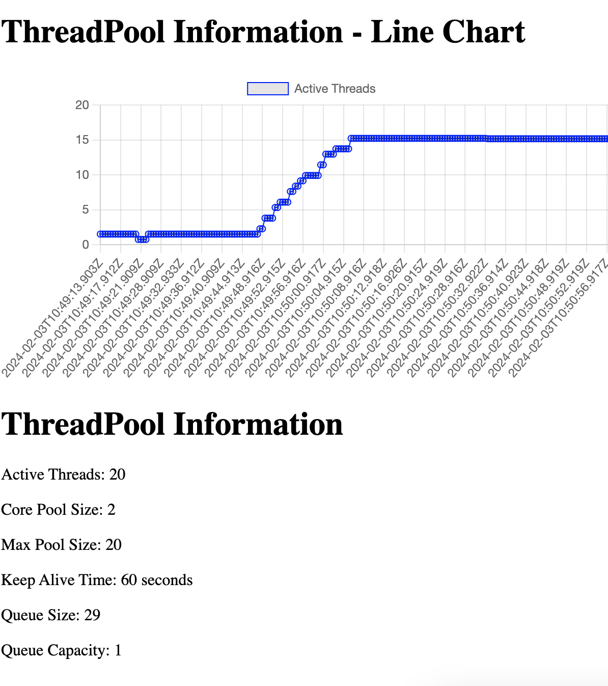

# Spring Asynchronous Service


## Introduction

@Async is an annotation in Spring Framework used to mark a method as asynchronous.
When a method is annotated with @Async, it tells Spring to execute that method asynchronously in a separate thread,
allowing the calling thread to continue its execution without waiting for the method to complete.

## Prerequisites

- Enable Async Support: To use @Async, you need to enable async support in your Spring application.
This typically involves adding the @EnableAsync annotation to one of your configuration classes or
XML configuration files.

- Annotate Methods: You annotate the methods that you want to be executed asynchronously with @Async.
 These methods should have a void return type or return a Future or CompletableFuture if you want to obtain
  the result of the asynchronous computation.

- Invocation: When a method annotated with @Async is invoked, Spring creates a proxy around that method and
executes it asynchronously in a separate thread managed by Spring's TaskExecutor.
Spring will automatically manage the lifecycle of threads and handle exception propagation.

## Example

```java
@Service
public class MyService {

    @Async
    public void asyncMethod() {
        // Asynchronous method body
    }
}
```
## Additional info
I use thymeleaf to create a simple web page to see information that you can access to bye in
rout and report.html



## Conclusion
Overall, @Async is a powerful feature in Spring that enables you to parallelize method execution and
improve application performance by leveraging concurrency.